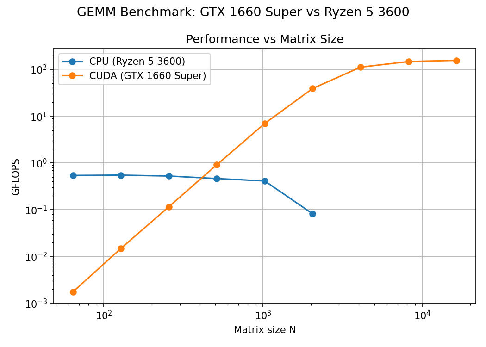
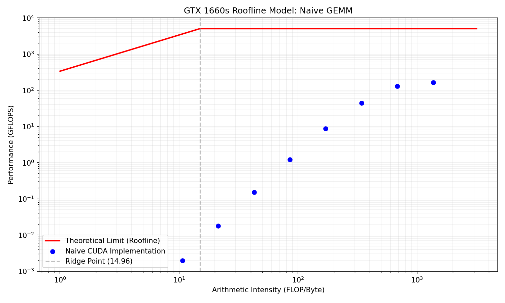

# multi-backend-gemm-benchmark
This project explores the GPU software stack from the ground up, moving from CPU baselines to multi-backend GPU compute. The goal is to gain hands-on experience with low level GPU programming and performance tuning accross different APIs.

It implements GEMM (General Matrix Multiplication) across multiple backends and profiles performance across matrix sizes. I've developed it on my GTX 1660 Super, with additional runs on Google Colab (T4) and an Intel UHD Graphics iGPU.

## Architecture
```
. ├──main.cpp 
├── cpu_backend.cpp       # OpenMP CPU implementation
├── cl_backend.cpp        # OpenCL host + kernel loading
│   └── kernel_gemm.cl    # OpenCL C kernel
└── cuda_backend.cu       # CUDA kernel + host code
└── results.py            # Automation, parsing, plotting
```
## Backends 
| Backend | Hardware | Status |
|--------|----------|--------|
| CPU | Ryzen 5 3600, x86 | Done |
| OpenCL | Intel UHD Graphics, NVIDIA T4| Done |
| CUDA | GTX 1660s, NVIDIA T4 | Done |
| ROCm | — | soon |
| SYCL | — | soon |
 
## Command
One challenge was getting CUDA and OpenCL to play nice in the same binary. Most of the "undefined reference" errors I ran into early on were actually just because my NVIDIA drivers were out of date.

**Unified Build (CUDA + OpenCL + CPU)**
```
nvcc -O3 main.cpp cpu_backend.cpp cuda_backend.cu cl_backend.cpp -Xcompiler -fopenmp -lOpenCL -o benchmark
```
## Results 
### CUDA vs CPU — GTX 1660 Super / Ryzen 5 3600

**Scalability**


 **Analysis**: 
At small scales (N<800), the CPU wins by avoiding the kernel launch overhead.
However, as the matrix size exceeds N = 512, the CPU hits the memory wall as the matrices outgrow the L3 cache capacity.
In contrast, the GPU scales via latency masking until N = 4096, where performance begins to plateau toward a peak of 162.9 GFLOPS as the naive kernel reaches the hardware's throughput ceiling.

**Speedup**

| N | CUDA/CPU |
|--------|-----|
| 64 | 0.04x |
| 512 | 0.22x | 
| 1024 | 3.56x | 
| 2048 | 39.24x | 
| 8192 | 232.76x |

**Roofline Map**

Hardware Constants GTX 1660S:

Peak Compute Ppeak = 5027 GFLOPS
Peak Bandwidth Bpeak = 336 GB/s
Ridge Point ​≈ 14.96 FLOP/byte

Roofline Analysis:

This analysis compares the Naive CUDA implementation against the physical limits of the hardware.

 
*AIalg* = Operations/Bytes Moved = $$\2N³/(3*N²)*4 = N/6\$$




**Regime**
| N | AIalg (N/6) | Performance (GFLOPS) | Regime|
|---|-------------|-------------|-------|
| 64 | 10.6 | 0.00197| Memory bound |
| **128**| 21.3 |  0.0180 | **Compute bound** |
| 1024 | 170.7 | 8.65 | Compute bound |
| 2048 | 341.3 | 44.7 | Compute bound |
| 8192 | 1365.3 | 163| Compute bound|
 
 **Insight**: 
 The implementation enters the *compute-bound* regime at N = 128, where the algorithmic intensity (21.3 flop/byte) exceeds the hardware ridge-point (14.96 flop/byte). 
 However, the efficency at this crossover rssemains near zero. Despite being compute bound, the Naive CUDA implementation only achieves **3.24 %** efficiency -> **The kernel is Latency bound**. 
 
## Next steps
- Shared memory tiling
- SYCL backend
- ROCm backend (AMD)
