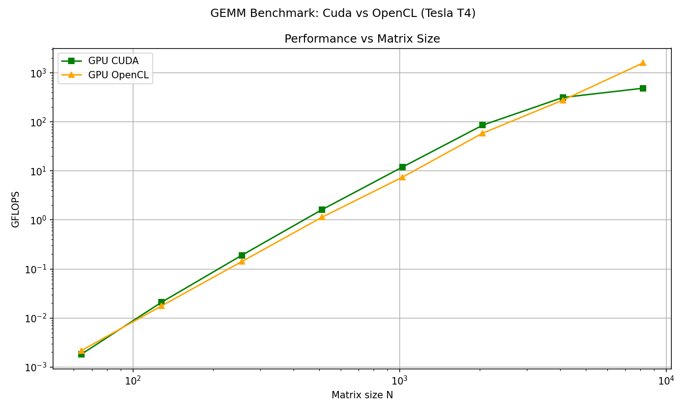

# multi-backend-gemm-benchmark
This project explores the GPU software stack from the ground up, moving from CPU baselines to multi-backend GPU compute. The goal is to gain hands-on experience with low level GPU programming and performance tuning across different APIs.

It implements GEMM (General Matrix Multiplication) across multiple backends and profiles performance across matrix sizes. I've first developed it on my GTX 1660 Super, then switched to Google Colab (T4).

## Architecture
```
. ├──main.cpp             # Unified benchmark with accuracy verification
├── cpu_backend.cpp       # OpenMP CPU implementation
├── cl_backend.cpp        # OpenCL host + kernel loading
│   └── kernel_gemm.cl    # OpenCL C kernel
└── cuda_backend.cu       # CUDA kernel _Tiled Shared Memory implementation_ + host code
└── results.py            # Automation, visualisation
```
## Backends 
| Backend | Hardware | Status |
|--------|----------|--------|
| CPU | Ryzen 5 3600, x86 | Done |
| OpenCL | Intel UHD Graphics, NVIDIA T4| Done |
| CUDA | GTX 1660s, NVIDIA T4 | Done + first optimisation |
 
## Command
One challenge was getting CUDA and OpenCL to play nice in the same binary. It works on linux environment but OpenCL struggles on Windows (even via WSL). 

**Unified Build (CUDA + OpenCL + CPU)**
```
nvcc -O3 main.cpp cpu_backend.cpp cuda_backend.cu cl_backend.cpp -Xcompiler -fopenmp -lOpenCL -o benchmark
```
**Launch**

For CUDA
```
python3 results.py 0
```
For OpenCL
```
python3 results.py 1
```
For CUDA vs OpenCL (vs CPU if CPU part is uncommented in main.cpp, Warning: 1h+ compute time for the CPU)
```
python3 results.py 2
```
## Phase 1: Naive Results on Local Baseline 
### CUDA vs CPU — GTX 1660 Super / Ryzen 5 3600

I started the project by comparing a naive CUDA kernel against a highly-threaded CPU on local hardware.

**Scalability**


 **Analysis**: 
> At small scales (N<800), the CPU wins by avoiding the kernel launch overhead and PCIe transfer.
However, as the matrix size exceeds N = 512, the CPU hits the memory wall as the matrices outgrow the L3 cache capacity.
In contrast, the GPU scales until N = 4096, where performance begins to plateau toward a peak of 162.9 GFLOPS.

**Speedup**

| N | CUDA/CPU |
|--------|-----|
| 64 | 0.04x |
| 1024 | 3.56x | 
| 2048 | 39.24x | 
| 8192 | 232.76x |

**Roofline Map**

GTX 1660s Ridge Point ​≈ 14.96 FLOP/byte

This analysis compares the Naive CUDA implementation against the physical limits of the hardware.

$$AI_{alg} = \frac{N}{6}$$


 
 **Analysis**: 
 > The implementation enters the *compute-bound* regime at N = 128, where the algorithmic intensity (21.3 flop/byte) exceeds the hardware ridge-point (14.96 flop/byte). 
 However, the efficiency at this crossover remains near zero. Despite being compute bound, the Naive CUDA implementation only achieves **3.24 %** efficiency -> **The kernel is Latency bound**.

## Phase 2: CUDA Optimisation
### Shared Memory Tiling
Due to driver interoperability limitations between OpenCL and WSL on my local setup, I transitioned the benchmarking and optimization phase to Google Colab's Tesla T4 to ensure a consistent environment across all backends. 
I implemented Shared Memory Tiling on the CUDA backend with 16 x 16 tiles to reuse data locally within the GPU's fast Shared Memory.

| | Naive T4 | Tiled T4 | Speedup|
|----|-------|-----------|---------|
|N =8192| 178 GFLOPS | 483 GFLOPS | **2.71x** |

## Phase 3: First optimised Results
### CUDA vs OpenCL (NVIDIA Tesla T4 - Google Colab)

Finally, I compared my manual CUDA optimization against a highly-tuned OpenCL backend.

**Scalability**



T4 peak performance = 8.1 TFLOPS
Peak efficiency(N=8192): CUDA 6.0% | OpenCL 19.4%

**Analysis**: 

 > While the CUDA Tiled implementation is efficient at medium scales, OpenCL shows a massive performance lead at N=8192. The reasons need to be explored in the next steps.

**Speedup**
| N | CUDA/OpenCL |
|--------|-----|
| 64 | 0.84x |
| 1024 | 1.61x | 
| 4096 | 1.13x | 
| 8192 | 0.30x |

## Accuracy
All results are cross-checked against the CPU reference with max_error < 10^-1. My implementation consistently stayed below 10−5 error margin.

## Next steps
To refocus the project I decided to not do the ROCM and SYCL backend and to instead improve this one.
- Tiling of 32 x 32
- Register Tiling
